# Student Score Management GUI

## About 

- Java GUI
- PostgreSQL on Docker

### Pages
- Course
- Course Detail 
- Student 

## Course Page 
List all courses

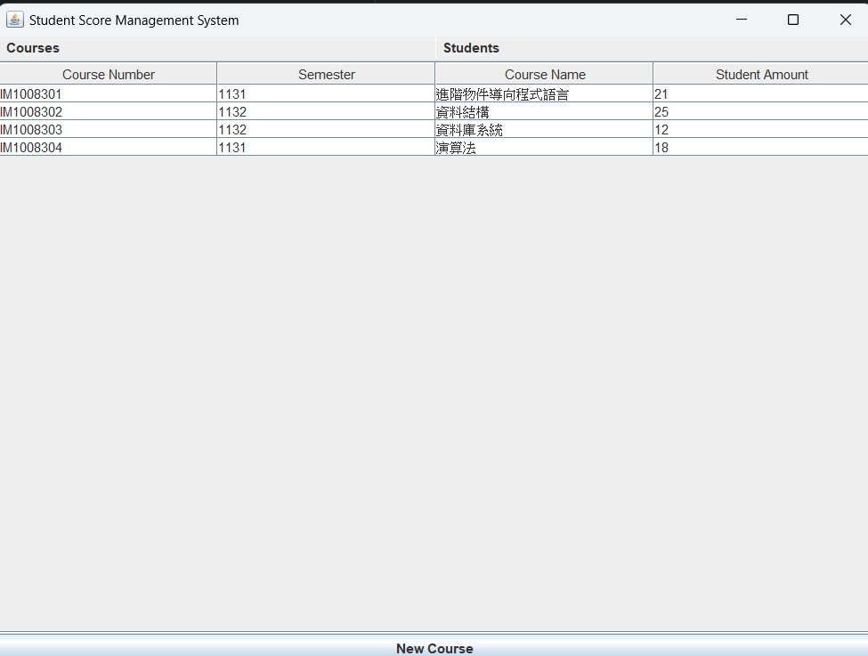

### A. Add new course
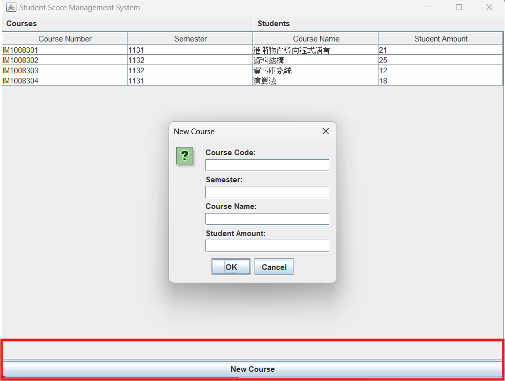

### B. Navigate to Course Detail Page
Click the course to open the information page.

## Course Detail Page
Various function to support the course management.

### A. Add new student
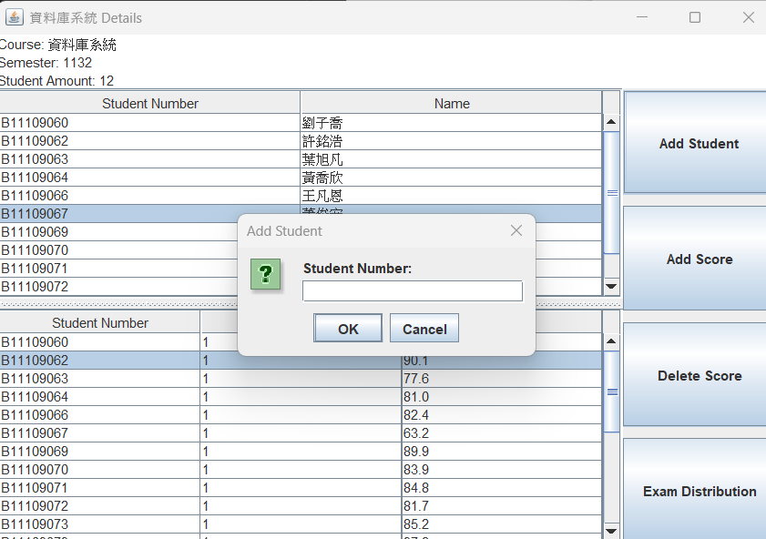

### B. Add new score
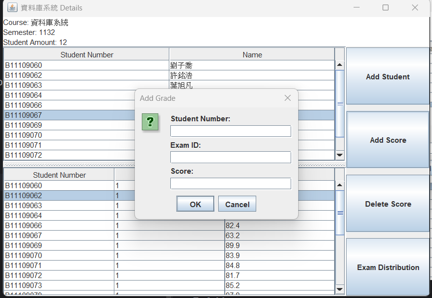

### C. Delete the score
- Select a score
  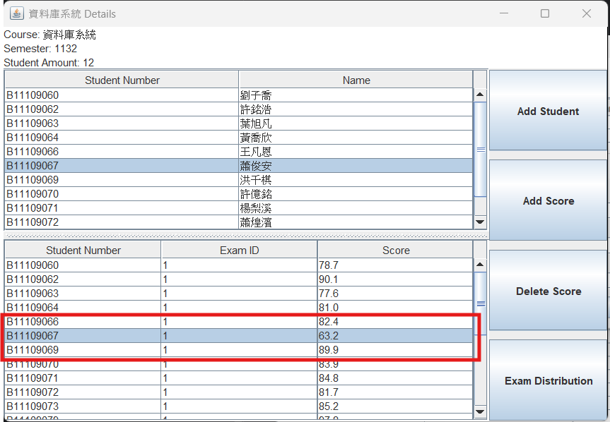

- Delete the score
  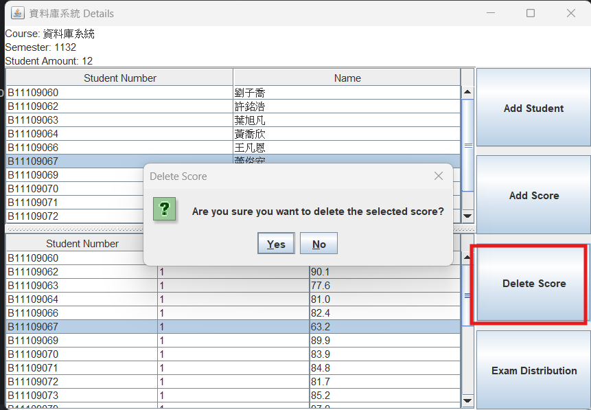

### D. Exam score distribution
- Find exam id
  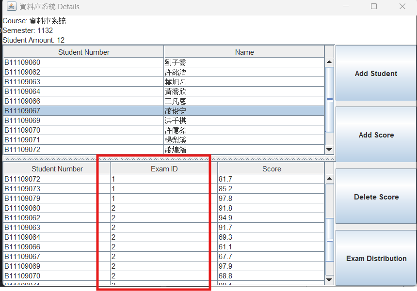

- Enter exam id
  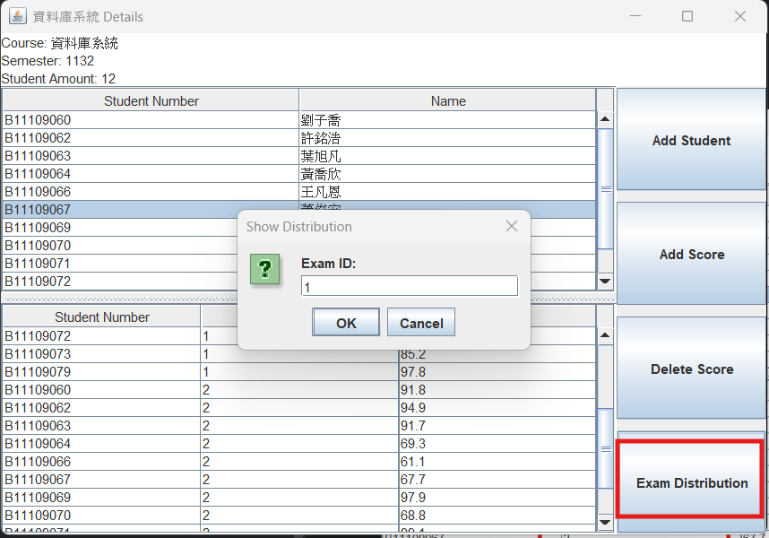
  
- Show graph
  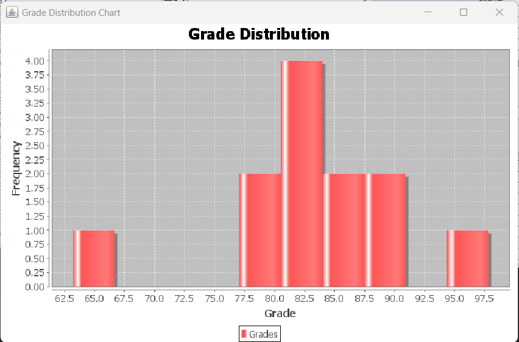

## Student Page
List all students;

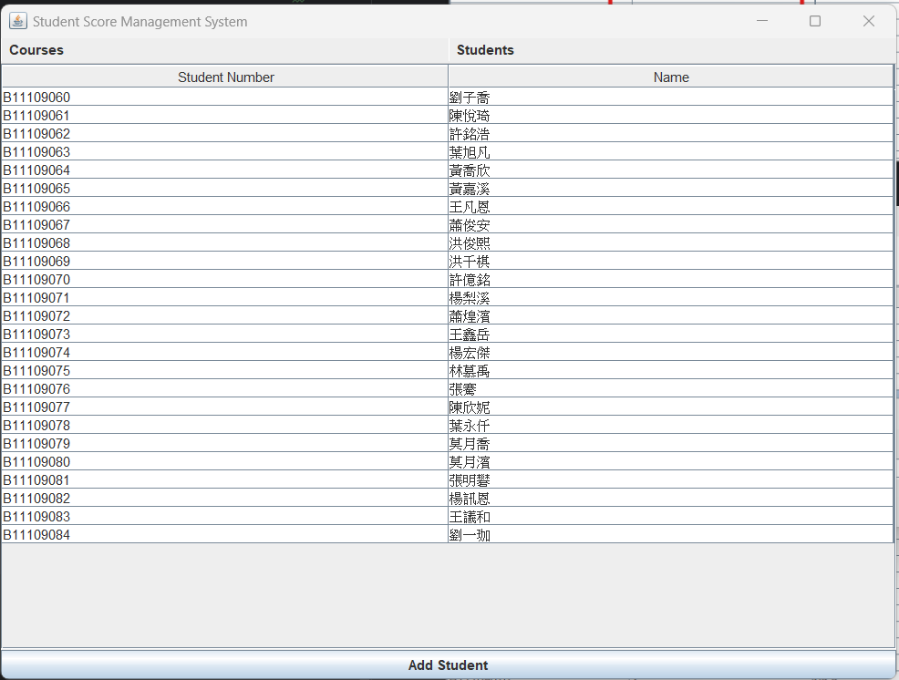

### A. Add new student
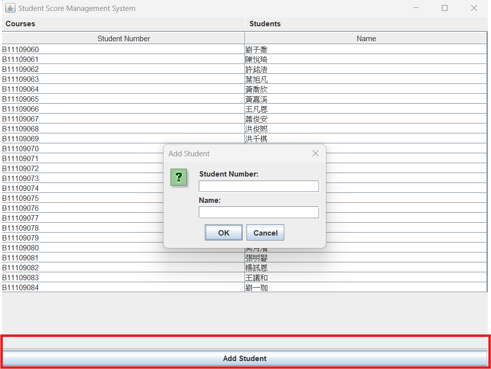

### B. Courses that student attended
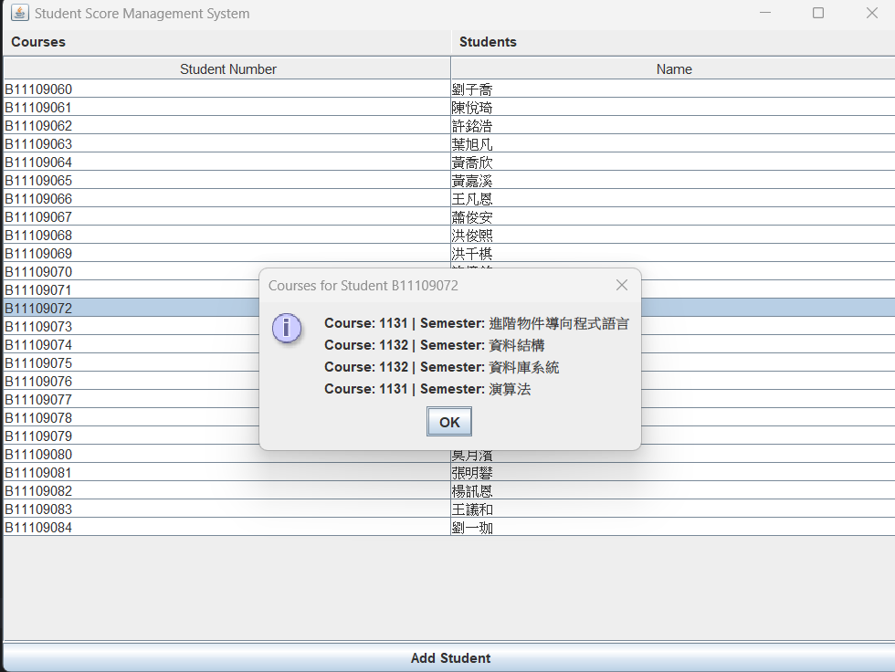